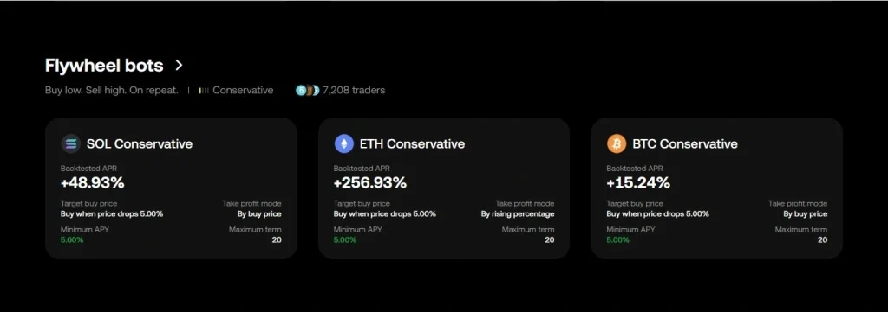

# OKX in 2025: The Exchange That's Becoming an Ecosystem

Curious how one of crypto's major exchanges transformed from just another trading platform into a unified Web3 powerhouse? OKX's 2025 evolution touches everything from automated earnings to early-access derivatives and institutional-grade infrastructure—all designed to work smarter, not harder.

---

By 2025, OKX has evolved far beyond being just "another high-volume exchange." Over the past year, the platform underwent a comprehensive overhaul, focusing on three key pillars: building its own ecosystem around X Layer and the OKB token, automating returns through Trading Account Auto Earn, and unifying trading infrastructure with a single USD orderbook. Meanwhile, the exchange strengthened its Web3 integration—OKX Wallet gained new capabilities and became the primary gateway into the ecosystem.

This review isn't about basic onboarding steps or first-time account setup. We're diving into updates that genuinely transform user experience: how traders now access new assets earlier, which passive income scenarios work without manual configuration, and how OKX is repositioning itself within crypto's broader landscape.

For existing OKX users, this is your chance to quickly understand what's changed and how new features save time and costs. For newcomers, it's an opportunity to see where the platform is headed and what advantages these new functions unlock.

Our focus isn't just listing updates—it's examining their practical value: why OKX introduced these mechanics, what they deliver in real use, and how they're transforming the exchange's role in the crypto ecosystem.

## Evolution of OKX: From Exchange to Multiplatform

2024–2025 marked a period of significant restructuring for OKX. The exchange didn't limit itself to interface tweaks or token additions—it pursued systemic changes affecting product architecture.

Rather than expanding a "service zoo," the company focused on simplification and unification. Some functions disappeared: the Infinity Grid trading bot was retired, and Easy Mode vanished from the wallet. These tools were replaced with more advanced alternatives—traders got a new arbitrage-focused Flywheel Bot, while the wallet gained full limit order and Web3 capabilities.

New products emerged simultaneously:

- Pre-market perpetuals—derivatives before token spot listing, giving active traders early access advantage
- Trading Account Auto Earn—returns on balances directly in your trading account, embedded in the broader automation trend

The platform's key transformation involved transitioning to a unified USD orderbook. Previously fragmented between USDT and USDC pairs, liquidity now converges at a single point. For traders, this means reduced slippage and more transparent pricing; for institutions, simplified API and backend operations.

A major technical update affected X Layer—OKX's proprietary L2 network. Originally running on Optimism's OP Stack with optimistic rollups, it migrated in 2025 to Polygon CDK—a modern framework for ZK-rollup networks. The network became faster, fees dropped, and Ethereum compatibility improved markedly. For users, X Layer now functions as a "native network" within OKX, with near-instant transfers and broader smart contract support.

Risk management also received upgrades. OKX updated Portfolio Margin with more precise calculations for multi-asset portfolios. Isolated margin became obsolete—replaced by a flexible model accounting for asset correlations, dynamic collateral distribution, and adaptive margin parameters based on current volatility.

👉 [Discover how OKX's unified trading infrastructure can streamline your crypto operations](https://www.okx.com/join/47044926)

## Trading and Risk Management

Over the past year, OKX's trading block received the most updates—touching not just trading instruments but the platform's core infrastructure: refreshed orderbooks, revised margin rules, and enhanced automation.

### Trading Account Auto Earn

The headline innovation for traders: automatic yield on idle balances. Funds in your trading account now automatically earn interest without lockup while remaining available as collateral or margin. This effectively erases the boundary between "trading account" and "passive income account."

Currently, auto-investing is only available for USDT, with expansion to other currencies planned. By default, it's disabled—you'll need to activate it manually. Minimum balance requirements depend on token price (cheaper assets require higher thresholds), and the maximum amount for Trading Account Auto Earn is 1 million USDT.

### Unified USD Orderbook

One critical change: OKX's transition to a unified USD orderbook. Previously split between USDT and USDC, all orders now consolidate into a single market with the USDⓈ ticker. Users choose which stablecoin to trade (USDC, USDG, etc.), while the system handles settlements automatically. For developers, a new mandatory API parameter—tradeQuoteCcy—specifies settlement currency.

### Pre-market Perpetuals

This new derivative type from OKX enables trading perpetual contracts on tokens before official listing. The instrument lets traders enter assets early, lock positions in advance, and prepare for volatility at spot launch. Fixed funding rates (paid every 4 hours) distinguish these from standard perpetuals. If a token lists and meets OKX criteria, the pre-market contract automatically converts to a standard perpetual futures contract.

### Margin Updates

July 2025 marked OKX's official discontinuation of isolated margin support in multi-currency and portfolio modes. The focus shifted to Portfolio Margin, which received updated MR parameters by year-start. The system now better accounts for position correlations—for instance, if a trader hedges BTC/ETH, margin requirements drop compared to independent trades.

Key parameter adjustments include tighter ranges for standard volatility scenarios, softened extreme move stress-tests, reduced basis risk coefficients for hedging, adjusted minimum charge thresholds for large positions, and refined stablecoin depeg risk logic.

## Passive Income and Earn Products

If OKX's Earn section was once a sprawling showcase of dozens of instruments, 2025 shifted toward simplicity and convenience. Instead of manually switching between products and tracking subscriptions, users now get automated income directly in their trading accounts.

### Dual Investment: Flexibility Through Early Redemption

Another significant change: the launch of early redemption for Dual Investment. Users can now exit products before expiration, removing constraints that previously locked positions until maturity. As of August 11, 2025, early redemption became available for all Dual Investment products (except ETH/BTC pairs), accessible 24 hours after yield begins and no later than 24 hours before settlement.

### Instant Access to Staked Assets: Quick Withdrawal for BETH and OKSOL

In 2025, OKX made on-chain staking more flexible by implementing quick withdrawal for BETH and OKSOL tokens—allowing instant access to staked assets without standard unstaking periods. The process is straightforward: select your asset, click "Withdraw," and confirm. While not available for all tokens and subject to amount limits, this feature significantly improved fund management in On-chain Earn.

## Automation and Copy Trading

OKX has always been among exchanges where trading automation developed as robustly as specialized bot platforms. But 2025 brought a product line overhaul: some old tools departed, replaced by more modern, focused solutions.

### End of Infinity Grid

Spring 2025 saw OKX officially retire the Infinity Grid Bot. The reason: the strategy never gained mass appeal and largely duplicated standard Spot Grid functionality. Rather than supporting two similar functions, OKX focused on clearer, more flexible instruments.

### Flywheel Bot: Betting on Arbitrage

Replacing niche Infinity Grid came Flywheel Bot—a more advanced arbitrage tool with automatic profit reinvestment. Its mission: earn from spot-futures price differences using a cyclical "buy low—sell high" strategy while reinvesting both principal and earned interest. This approach creates a flywheel effect (hence the name), compounding returns without manual intervention.

### OKX Copy Trading: System Overhaul for Control and Flexibility

May 2025 brought official updates to OKX's copy trading system. Lead traders gained the ability to close positions with limit orders and specify individual close volumes—just like professionals in regular trading. The update added limit orders for closing trades, flexible close volumes (partial position closures), and full TP/SL (take-profit and stop-loss) functionality.

For followers, this means greater precision and less dependence on market volatility. Trades close as leaders intended, not in truncated versions—especially crucial for strategies tied to specific price levels.

## Web3 and OKX Wallet

If OKX Wallet was once perceived as a "supplement to the exchange," by 2025 it became the ecosystem's full-fledged hub. The exchange clearly positions the wallet not as a separate app but as the primary Web3 and X Layer gateway.

### Simplified Withdrawal Addresses

First noticeable change: streamlined withdrawal interface. OKX simplified address type selection and network compatibility. Address type divisions (Standard / EVM / Universal) disappeared—each address within a chosen network now supports all compatible cryptocurrencies. This solves one of the most common user issues at withdrawal: losing funds due to incorrect address selection.

### Ronin Integration and Technical Updates

July 31, 2025 brought address format updates for the Ronin network. August 4 temporarily disabled Auto-confirm (automatic transaction confirmation in Web3 wallet) for system rework, with Solana receiving the update first. August 15 saw the official shutdown of X Layer's frontend bridge—users now employ community-chosen third-party bridging solutions.

### Gateway to X Layer: Web3 Wallet as Entry Point

One of OKX's key strategic directions in 2025: developing X Layer, its proprietary L2 network on Polygon CDK. Post-upgrade, OKX Wallet became the primary ecosystem gateway. Low fees, fast confirmations, and friendly interface made X Layer attractive for both developers and regular users. Deep integration with OKX's centralized exchange and OKX Pay made moving funds between Web2 and Web3 virtually seamless.

## X Layer and OKB Economics

In 2025, X Layer became the symbol of OKX's transformation from mere exchange to complete ecosystem. Network upgrades, tokenomics overhaul, and retirement of legacy solutions like OKTChain demonstrate the company's foundation-building for long-term strategy.

### X Layer Upgrade to Polygon CDK

As mentioned, X Layer migrated to Polygon CDK infrastructure in 2025, delivering substantial improvements: TPS jumped to thousands of transactions, fees dropped to symbolic levels, and Ethereum compatibility strengthened further. This enables not just fast transfers and cheap gas but convenient exchange integration.

Simultaneously, the exchange announced OKTChain's "sunset." OKT token trading ceased, with users offered OKB migration. The network will only be supported until early 2026, after which it fully phases out.

### OKB: Core of New Economy

2025 proved pivotal for OKX's key ecosystem token. OKB isn't just the exchange's internal "coin"—it provides fee discounts, unlocks token sales and premium Earn products, participates in governance votes, and increasingly appears in DeFi instruments.

Spring 2025 elevated OKB to a new level. Portions of token functionality moved on-chain—a step toward deep Web3 infrastructure integration. OKB now functions not only in CEX products but also in solutions like X Layer and OKX Wallet.

👉 [Start earning with OKX's automated yield solutions today](https://www.okx.com/join/47044926)

## API and Institutional Features

If 2025 will be remembered by retail traders for Trading Account Auto Earn and Pre-market Perpetuals, changes for professional audiences proved equally substantial. OKX clearly strengthened its API, reporting, and VIP program blocks, targeting institutions and large clients.

### Unified USD Orderbook: New Rules for Bots

For developers and arbitrage strategies, the main event: liquidity consolidation into a unified USD orderbook. In API terms, this introduced the tradeQuoteCcy parameter—explicitly specifying stablecoin settlement currency. Externally minor, practically it requires updating entire arbitrage software stacks. The payoff: less fragmentation, unified order books, more predictable algorithmic trading pricing.

### Sub-accounts and Key Management

OKX elevated sub-account operations to professional standards—institutional clients gained ability to not only create sub-accounts but manage their API keys through programmatic endpoints. Large funds and trading desks can now automatically create and configure dozens of accounts, set specific access rights, generate task-specific keys—without support tickets or manual intervention.

### Enhanced Reporting: Transparency at Fintech Standards

Another significant update touched financial reporting. The platform strengthened asset bills and balances sections, adding parameters and expanding transaction detail. Users can now export complete fund movement logs with precise values for instruments, fees, and operation types—especially valuable for auditors, accounting, and risk management teams.

### VIP Segment: New Perks

The loyalty program for large clients extended beyond standard privileges in 2025. Beyond familiar fee discounts and personal managers, tools directly impacting capital efficiency emerged: Trading Account Auto Earn for VIP clients, BTC Yield+ specialized earning program, and updated status calculation conditions now factoring Earn product participation.

---

## Conclusion

After all 2025 updates, OKX looks different to different audiences. The exchange stopped being a "universal constructor where everyone searches for their own" and transformed into a platform with tailored tools for each role—whether you're a trader benefiting from unified liquidity, an investor leveraging flexible passive income options, an institutional player with sophisticated risk management, or a Web3 user accessing the entire ecosystem through one interface.

In the end, OKX segmented its audience and offered ready solutions to each group. The platform's transformation from a feature-packed exchange to a cohesive crypto ecosystem makes it particularly suitable for users seeking both centralized trading efficiency and decentralized Web3 opportunities in one unified environment.
